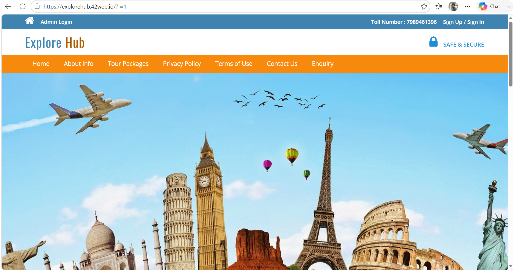

# tms
```
# 🌍 ExploreHub – Tourist Management System

## Overview

ExploreHub is a full-stack web-based Tourist Management System developed to provide a seamless platform for exploring tourist destinations and managing travel bookings. The application is designed with a modern, responsive interface and offers an efficient experience for both users and administrators.

Built using **HTML5, CSS3, JavaScript, PHP, MySQL, and XAMPP**, the system combines an interactive frontend with a robust backend to deliver secure data management and smooth functionality.

## Live Demo

🌐 **Website:** https://explorehub.w42web.io

## Technologies Used

### Frontend

* HTML5
* CSS3
* JavaScript

### Backend

* PHP

### Database

* MySQL

### Development Environment

* XAMPP (Apache & MySQL)

## Key Features

* Secure User Registration and Authentication
* Browse Tourist Destinations
* Tour Package Management
* Online Booking System
* Responsive and Mobile-Friendly Design
* Administrative Dashboard
* Contact and Inquiry Management
* Dynamic Database Connectivity
* Clean and Intuitive User Interface

## Project Objectives

* Simplify the travel planning process.
* Provide a centralized platform for tourism information.
* Enable efficient booking management.
* Deliver a responsive and user-friendly web experience.
* Demonstrate full-stack web development concepts.

## Installation

1. Clone this repository.
2. Copy the project folder to the **XAMPP htdocs** directory.
3. Import the provided MySQL database using **phpMyAdmin**.
4. Start **Apache** and **MySQL** from the XAMPP Control Panel.
5. Access the application through your local server or the deployed website.
```
## Project Structure

```text
ExploreHub/
├── assets/
├── css/
├── images/
├── js/
├── database/
├── includes/
├── index.php
├── login.php
├── register.php
└── README.md
```

## Developer

**Mooli Sravanth Reddy**

* GitHub: https://github.com/Sravanthreddy304

  


`
